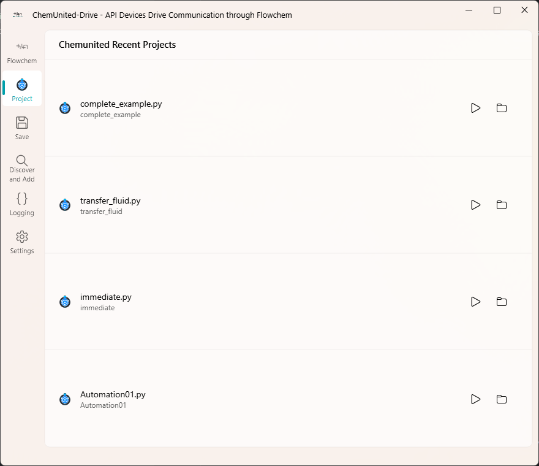
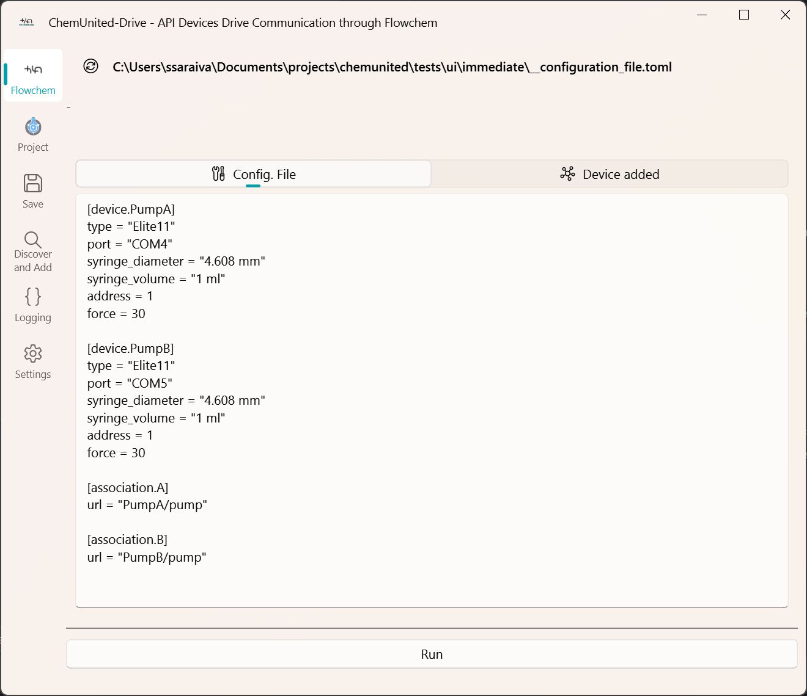
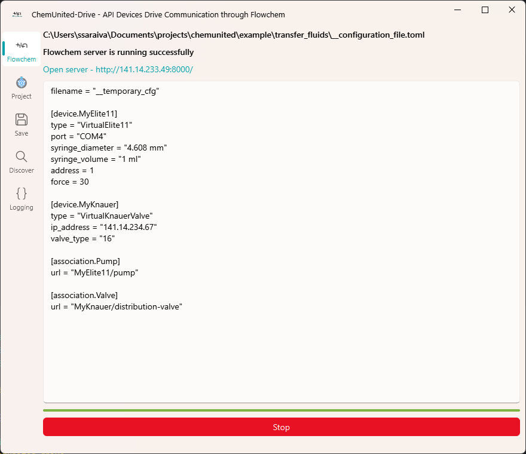
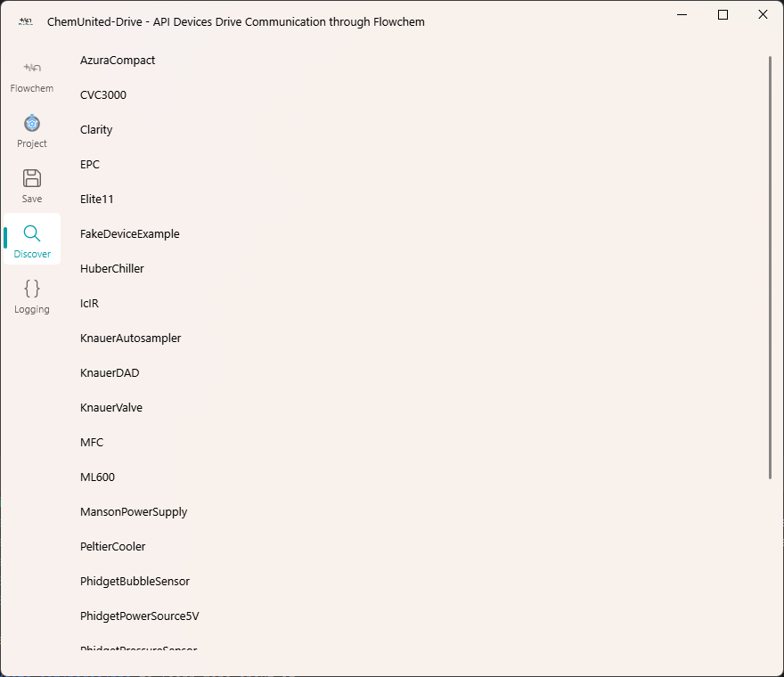

# ChemUnited-Drive Application

This application provides a graphical interface to manage, configure, and run FlowChem projects.
It allows users to load project configuration files, discover connected devices, edit settings, 
and launch the FlowChem server directly from the interface.

## 🧩 Overview

ChemUnited-Drive acts as a friendly GUI for `FlowChem` configurations, and easily integration whit `ChemUnited Orchestration`.
It bridges the gap between device setup and automation, allowing you to:

* Load existing FlowChem project folders.

* View and edit the __configuration_file.toml.

* Discover supported FlowChem devices (serial or Ethernet).

* Start and stop FlowChem servers from the GUI.

* View process logs in real time.

## 🖼️ Application Workflow

### 1. Main Interface

The main window provides four tabs for navigation:

| Tab          | Purpose                                        |
| ------------ | ---------------------------------------------- |
| **FlowChem** | View and edit the configuration file.          |
| **Project**  | Manage and open existing project folders.      |
| **Discover** | Automatically find connected FlowChem devices. |
| **Logging**  | View logs and FlowChem process messages.       |

### 2. Projects View



The Project tab lists all recent FlowChem projects stored in your workspace.

Each card offers:

* ▶️ Run – Load and execute the project’s configuration file.

* 📂 Open Folder – Open the project directory in the system file browser.

### 3. Configuration View



When a project is loaded, its configuration file (__configuration_file.toml) is displayed and can be edited.

Use:

* *Run* → to start the FlowChem server.

* *Stop* → to terminate it.

A progress bar shows the initialization status, and the application provides live feedback and clickable server links once the process is running.

### 4. Run and Monitor FlowChem



When you press Run, the GUI performs the following sequence:

* Saves any edits to a temporary TOML file.

* Asks if you want to terminate existing FlowChem processes.

* Launches FlowChem as a subprocess (flowchem.__main__.py) via QProcess.

* Displays logs and connection information.

Once the server starts (http://127.0.0.1:8000), a direct link appears in the GUI.

Stopping the server gracefully sends a SIGINT or CTRL_BREAK_EVENT, ensuring a clean shutdown.

## 🚀 Running the Application

To start the GUI manually, run:

```bash
python -m ChemunitedDrive
```

or, if installed as a package:

```bash
chemunited-drive
```

## 🧰 Device Discovery



The Discover tab uses built-in FlowChem finders to detect connected devices:

* Serial devices (via pyserial and aioserial).

* Ethernet devices (via broadcast search using user-defined IP).

Each discovered device automatically appends its configuration block to the current TOML file.

## 🗂️ Temporary Files

All temporary and recent project files are stored in:

`%APPDATA%/ChemUnited/ChemUnited_Recent_Projects`

This includes:

* `__temporary_cfg.toml` – last edited configuration.

* `recent_projects.toml` – list of project paths.

# 🧾 Logging

The application logs:

* QProcess messages from FlowChem.

* Success, warning, and error InfoBars.

* Full traceback details in case of exceptions.

Logs appear both in the Logging tab and in the console (via loguru).