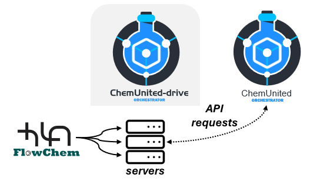

# Setup Connectivity

The electronic connection and access of the capabilities of the devices occurr through the FlowChem package. 
Basically, this packages expose all components capabilities in a server which can be access through api requests. 
It assure iteropelabitie and decoupling of orchestration execution depedence.
See details in the [package documentation](https://flowchem.readthedocs.io/en/latest/).

The ChemUnited-Drive is a tool to user lunch, configure and access the FlowChem server in a friendlly way. 
More detail how it work go to [ChemUnited-Drive](chemunited_drive.md).

## Associate components

With 