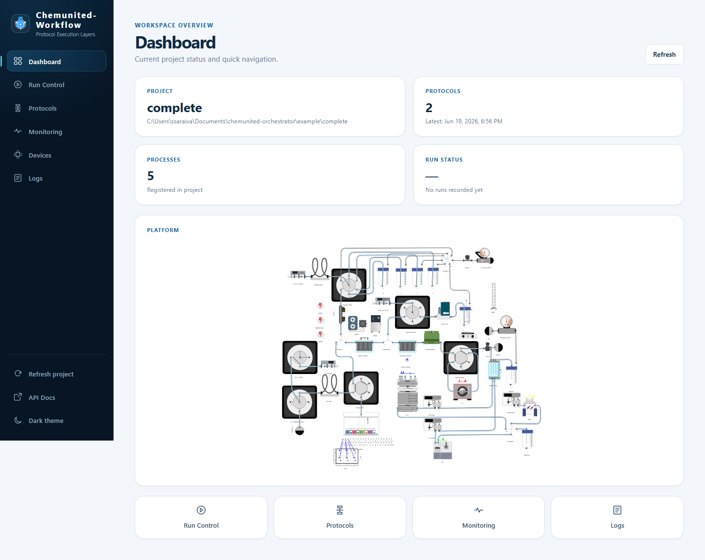

# 📊 Dashboard

The **Dashboard** is the browser-based web app served by the work-server (`chemunited-workflow`) alongside its
REST/MCP API. It's how you interact with a project — start runs, build protocols, watch live data, and check
connectivity — from any browser, without the desktop orchestrator app open. Start it from the desktop app's
[Dashboard Launcher](launcher.md), or run `chemunited-workflow serve` directly; either way it opens at
`http://127.0.0.1:<port>/` (default port `3116`).

The dashboard has six pages, reachable from the sidebar on the left of every page:

* **Dashboard** (this page) — project status at a glance and quick navigation.
* **[Run Control](run_control.md)** — start or cancel a run, and watch it execute live.
* **[Protocols](protocols.md)** — assemble processes into a saved, repeatable protocol.
* **[Monitoring](monitoring.md)** — poll live device variables outside of a run.
* **[Logs](logs.md)** — browse and tail execution log files.
* **[Devices](devices.md)** — check connectivity for every component in the project.

At the bottom of the sidebar: **Refresh project** (reload project state from disk), **API Docs** (opens the
work-server's OpenAPI docs — see [API & MCP Tools](../execution/api_and_mcp.md)), and a **Dark theme** toggle.

## Landing page

Four cards summarize the loaded project:

| Card | Shows |
|---|---|
| **Project** | The project's name and its folder path on disk. |
| **Protocols** | How many protocol files are saved, and when the most recent one was saved. |
| **Processes** | How many processes are registered in the project. |
| **Run Status** | Whether a run is currently active, or `No runs recorded yet`. |

**Refresh** re-reads all four cards from the server. Below them, the **Platform** card renders the project's
platform diagram (the same layout you build in [Drawing](../drawing/drawing.md)), useful for a quick visual sanity
check of the loaded setup. At the bottom, four quick-navigation cards jump straight to Run Control, Protocols,
Monitoring, and Logs.
