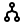
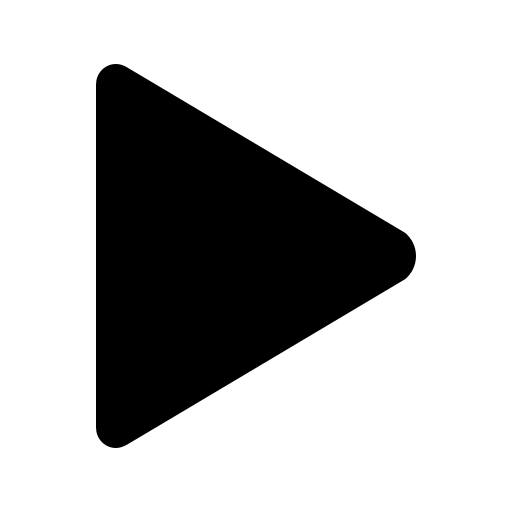
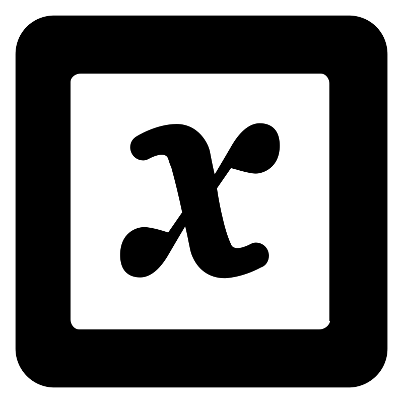

# Build Protocols

The objective of this frame is to create and organize the protocols that define how the platform operates.

Before explaining how the orchestration system is designed to build these protocols, it is important to understand 
how the protocol structure is organized within the package.

## 🧩 Protocol Hierarchy

The following diagram illustrates the hierarchical relationship between the different elements that make up a protocol:

<strong>💡 Information</strong>  
This hierarchical organization allows the orchestration to combine automation logic with flexible scripting. 
Complex experimental protocols can therefore be built by combining processes, modules, and component-level commands. 

## Explanation of Each Level

### 💻 Protocol

A protocol is the highest level in the orchestration hierarchy.
It is composed of a series of processes, which are executed sequentially, one after another.

###  Process

Each process contains one or more workflows composed of modules.
Processes are executed in sequence, but within a process, the modules can run simultaneously through a multithreading workflow.

###  Module

A module represents a Python script containing a sequence of commands.
This design gives the user complete flexibility — any Python libraries can be used to support the protocol development.

###  Command

A command is the lowest-level instruction in the hierarchy.
It represents a specific request or actuation sent to an electronic component in the system (e.g., start a pump, read a sensor, open a valve).

###  Parameters

The Parameters script defines a set of variables that the user can create and reuse across the entire platform.
This feature is optional, but extremely helpful for complex setups where protocols depend on shared values, user-defined constants, or validation logic.

There are two types of parameters:

* Main Parameters – global variables available to all protocols in the project.
These typically define general configuration values that remain consistent throughout the orchestration.

* Process Parameters – local variables defined within a specific process.
They apply only to that process and allow fine-tuning of parameters without affecting other parts of the platform.

Using parameters promotes modularity and flexibility: the same protocol can be reused with different parameter sets, and complex workflows can automatically validate or adjust values before execution.

## ChemUnited Protocols Frame

*  **Experiment Parameters**

...

*  **Inspect Modules**

...

*  **Create Connection**

...

*  **Remove Object**

...

*  **Save Draw**

...

*  **Add Component**

...

*  **Inspect Draw**

...
