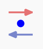
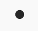
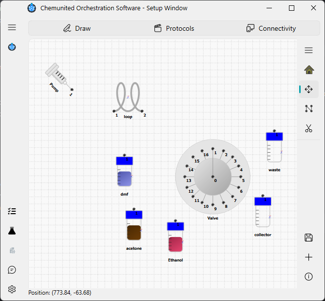

# Drawing

The objective of this frame is to allow the user to design their own platform by dragging and dropping components onto the canvas.

Below is a description of the main tools available in this window:

*  **Home**

Centers the drawing on the canvas. This is useful for reorienting the view and exploring your setup more easily.

*  **Move Object**

Activates the mode to move components or connections within the drawing area.

*  **Create Connection**

Enables the connection mode, allowing you to build connections between components.

*  **Remove Object**

Allows the removal of selected components or existing connections from the drawing.

*  **Save Draw**

Saves all modifications made to the current project file.

*  **Add Component**

Opens the component library, from which you can add new electronic elements or utensils to the setup.

*  **Inspect Draw**

This mode helps you inspect the properties of components.
While you can double-click any component to open its properties, this mode also brings all components to the front of the drawing to make inspection easier.

  <strong>💡 Information</strong> 
  To <b>view or edit the properties of a connection</b>, activate <b>Inspect Draw</b> mode  
  and click on the <b>inflexion points</b> of the connection to display its parameters.

## Component available

This panel lists all components available for building your setup, organized into categories.

  
  

## Connections

Connections define how components interact within the setup. Each connection begins and ends at a connection point, 
and each point belongs to a specific category. Only connection points of the same category can be linked.

### Types of Connection Points

There are four standardized connection point types:

*  **Flow Connection Point**

Represents standard connections used for tubing that transports fluids through the system.

*  **Heat Connection Point**

Used for defining heat-transfer relationships between components during simulation.
These connections affect simulated thermal behavior, but they do not influence the execution of the real protocol.

*  **Electronic Connection Point**

Used for connections that transmit electronic control signals.
While devices in ChemUnited can be accessed directly, in certain cases, it is more 
efficient to trigger device actions through the microcontroller connected to it. This is especially useful when 
several devices must be activated simultaneously.
For more details on the microcontroller implementation, see the referenced documentation.

*  **Flow Connection Point**

An extension of the flow connection, used to represent the movement of samples—typically handled by mechanical 
arms, gantries, or other robotic modules.

<strong>⚠️ Warning</strong> 
A connection can only be established between points of the same type (Flow–Flow, Heat–Heat, Electronic–Electronic, or Movement–Movement).

## Components & connections properties

After adding a component, a window will appear where the user can provide the component’s details.
The most important field is the name, which serves as the unique identifier for accessing the component throughout the entire project.

<strong>⚠️ Warning</strong> 
Choose the component name carefully. All properties, protocols, and orchestration features are linked to this name. 
If you need to rename a component later, the recommended approach is to <b>remove it and recreate it</b> 
using the new name. 

Unlike components, connection properties do not open automatically.

 
<strong>💡 Information</strong>  
While all components share some common parameters, each one also includes
<b>specific adjustable settings</b> depending on its type.

More details about each component can be found in the reference section: [Components Available](../reference/components.md).

## Learning example

Returning to our learning example, you can follow the step-by-step demonstration shown in the video below.

### 1 — Insert all components

To add a component to the drawing:

a - Select it from the desired category,

b - Click Add,

c - Then click on the canvas where you want to place it.

Begin by inserting all the components exactly as shown in the illustration:

The components required for this setup are:

* **1 x Syringe Pump** - from `pump` group

* **1 x Sixteen Port Distribution Valve** - from `valve` group

* **1 x Loop** - from `glasses` group

* **5 x Glass Bottle** - from `glasses` group

  

 
<strong>💡 Information</strong>  
To set an inclination for the pump, simply double-click the component to open the properties window. 
Then, adjust the angle to <strong>45°</strong>.

### 2 - Build connections

A connection is created by linking two compatible connection points.
When building a connection, the user may add several inflection points to better route the connection through the setup layout.
Connections can also be reshaped—made more curved or more linear—to improve the clarity and aesthetics of the design.

