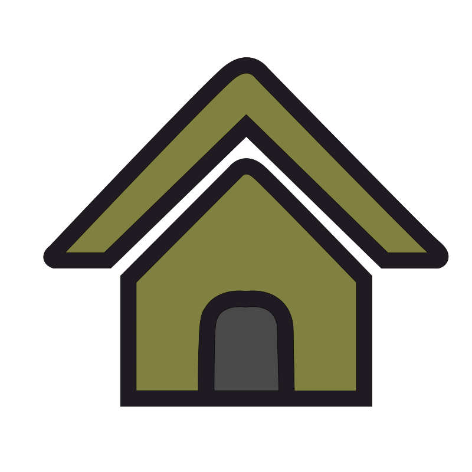

# Drawing

The objective of this frame is to allow the user to design their own platform by dragging and dropping components onto the canvas.


Below is a description of the main tools available in this window:

*  **Home**

Centers the drawing on the canvas. This is useful for reorienting the view and exploring your setup more easily.

*  **Move Object**

Activates the mode to move components or connections within the drawing area.

*  **Create Connection**

Enables the connection mode, allowing you to build connections between components.

*  **Remove Object**

Allows the removal of selected components or existing connections from the drawing.

*  **Save Draw**

Saves all modifications made to the current project file.

*  **Add Component**

Opens the component library, from which you can add new electronic elements or utensils to the setup.

*  **Inspect Draw**

This mode helps you inspect the properties of components.
While you can double-click any component to open its properties, this mode also brings all components to the front of the drawing to make inspection easier.

<div class="info-block">
  <strong>💡 Information</strong><br>
  To <b>view or edit the properties of a connection</b>, activate <b>Inspect Draw</b> mode  
  and click on the <b>inflexion points</b> of the connection to display its parameters.
</div>


## Component available

This panel lists all components available for building your setup, organized into categories.
To add a component to the drawing:

1 - Select it from the desired category,

2 - Click Add,

3 - Then click on the canvas where you want to place it.

<p align="center">
  
  
</p>

## Components & connections properties

After adding a component, a window will appear where the user can provide the component’s details.
The most important field is the name, which serves as the unique identifier for accessing the component throughout the entire project.

<div class="warning-block">
<strong>⚠️ Warning</strong><br>
Choose the component name carefully. All properties, protocols, and orchestration features are linked to this name. 
If you need to rename a component later, the recommended approach is to <b>remove it and recreate it</b> 
using the new name. 
</div>

Unlike components, connection properties do not open automatically.

<div class="info-block"> 
<strong>💡 Information</strong><br> 
While all components share some common parameters, each one also includes
<b>specific adjustable settings</b> depending on its type.
</div>

More details about each component can be found in the reference section: [Components Available](../reference/components.md).

## Learning example

Back to our learning example, you can follow the step-by-step demonstration shown in the video below.

```{video} ../_static/demo.mp4
:autoplay:
:loop:
:width: 700
```