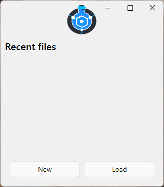
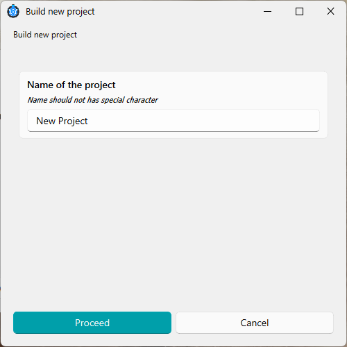
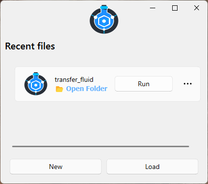

# 🧩 Designer Welcome

In this section, we will walk through all the steps involved in creating a new project.
You will learn the essential concepts needed to build simple setups and run them successfully.

After installing chemunited, launching the Designer is as simple as typing the following command in your terminal:

```bash
chemunited
```

This opens the **Recent Projects** window:

<p align="center">

</p>

By clicking New, the user is prompted to provide a project name and select a directory where the project files will be saved:

<p align="center">


</p>

Each time you create or open a project, its directory is stored in a temporary reference file.
This allows **chemunited** to display your recent projects automatically when the application starts, giving you quick and direct access to your work.


## 📘 Learning Tutorial

To dive deeper into the package, a tutorial is available that guides you through building a very simple setup.
For each step of the tutorial, the user will learn how chemunited works in practice.

The goal is to build the simple setup shown below:

<p align="center">

</p>

This setup is responsible for transferring a defined volume of fluid from one vessel to another.