# Component core concepts

Every pump, valve, sensor, and vessel you drag onto the [Draw](../drawing/drawing.md) canvas is, underneath the
icon, the same small set of building blocks arranged differently. This page explains that shared model —
independently of any single component — so that [Add new components](add_components.md) reads as "fill in these
blocks" rather than a list of unexplained rules.

<div class="info-block">
<strong>💡 Who this is for</strong><br>
You don't need this page to <em>use</em> ChemUnited — it's for anyone writing a new component in
<code>chemunited-core</code> (built-in or project-local), or who just wants to understand what a component
"really is" once it's compiled.
</div>

## Two objects, one component

Every component is described by a pair of Python objects, not one:

* **`ComponentMode`** — a Pydantic model. This is the *configuration*: the fields a user edits in the property
  panel, and what gets saved to the project's config files. Base fields every component has: `name` (its unique
  identifier — see the naming warning in [Drawing](../drawing/drawing.md#components--connections-properties)),
  `figure` (which catalog entry/icon it uses), `position`, `angle`, and `mirror`.
* **`ComponentData`** — a plain dataclass. This is the *compiled runtime structure*: the same base fields, plus
  the actual graph of ports, internal channels, and storage that the simulator and GUI both read.

A `ComponentData` is always built *from* a `ComponentMode`, never authored by hand — and stays in sync with it
every time the user edits a property:

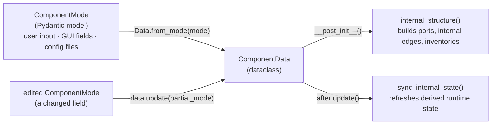
```mermaid
flowchart LR
    Mode["ComponentMode<br/>(Pydantic model)<br/>user input · GUI fields · config files"] -->|"Data.from_mode(mode)"| Data["ComponentData<br/>(dataclass)"]
    Data -->|"__post_init__()"| Build["internal_structure()<br/>builds ports, internal edges, inventories"]
    Edit["edited ComponentMode<br/>(a changed field)"] -->|"data.update(partial_mode)"| Data
    Data -->|"after update()"| Sync["sync_internal_state()<br/>refreshes derived runtime state"]
```

<div class="info-block">
<strong>💡 Rule of thumb</strong><br>
Put anything the user should configure or that must survive being saved on <code>*Mode</code>. Put the compiled
result — ports, edges, inventories, and any command-driven behavior — on <code>*Data</code>.
</div>

## Anatomy of a component's internal graph

`internal_structure()` is what every component implements to describe its own tiny internal graph. That graph is
built from four kinds of pieces:

### Ports — connection points

A `Port` is a physical connection point on the component — the little dot you draw a wire or a tube to/from on
the canvas. Each one has a `number` (unique within the component), a `category`, an `access` side (`TOP`/`BOTTOM`
— vessels use this to tell gas-side from liquid-side access), a `closure` (`OPEN`/`CAPPED`), and an optional
`boundary` (see below).

The `category` is one of the same four connection types you already choose between when wiring components
together on the canvas (see [Connections](../drawing/drawing.md#connections)) — the code names below match what
you'll see in `chemunited_core`; the canvas panel labels the first one "Flow" instead of "Hydraulic":

*  **HYDRAULIC** — tubing that carries fluid.
*  **HEAT** — thermal coupling used by the simulator only.
*  **ELECTRONIC** — a control-signal connection.
*  **MOVEMENT** — sample transport (gantries, robotic arms).

A port can also be a hidden **hub** (`is_hub=True`, `show_in_graph=False`) — an internal staging node that never
appears on the canvas, used by pumps and distribution valves to model a shared internal manifold.

### Internal edges — channels inside the component

An `InternalEdge` is a directed path between two endpoints *inside* one component's own subgraph — most often
between two of its ports, but an endpoint can also be an inventory key (see below), letting an edge connect a
port straight into storage.

Every internal edge plays one of two roles:

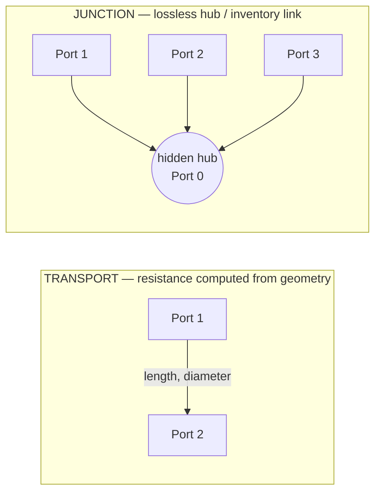
```mermaid
flowchart LR
    subgraph T["TRANSPORT — resistance computed from geometry"]
        T1["Port 1"] -->|"length, diameter"| T2["Port 2"]
    end
    subgraph J["JUNCTION — lossless hub / inventory link"]
        J1["Port 1"] --> J0(("hidden hub<br/>Port 0"))
        J2["Port 2"] --> J0
        J3["Port 3"] --> J0
    end
```

* **`TRANSPORT`** — a real physical channel (tubing, a reactor coil). Its hydraulic resistance is derived from
  `length` and `diameter` (Hagen–Poiseuille), unless overridden.
* **`JUNCTION`** — a near-lossless internal connection, used to join ports to a hidden hub or to an inventory
  node.

Any edge can be switched: `edge.close()` sets its resistance to the solver's effective-infinite constant
(`R_MAX_HYDRAULIC`); `edge.open()` clears the override so resistance goes back to being geometry-based. This is
the mechanism every valve uses — see [Switchable edge](#switchable-edge) below.

### Inventory nodes — lumped storage

An `InventoryNode` represents a well-mixed lump of storage — the inside of a flask, a reactor, a syringe barrel.
It holds two phases, `liq_content` and `gas_content`, each a `VolumeContentBase` (a volume, a phase, and the
moles of each chemical species it contains). A component can have zero inventory nodes (plain tubing), one (a
flask, keyed `"Inventory"` by convention), or several (a multi-well plate has one per well).

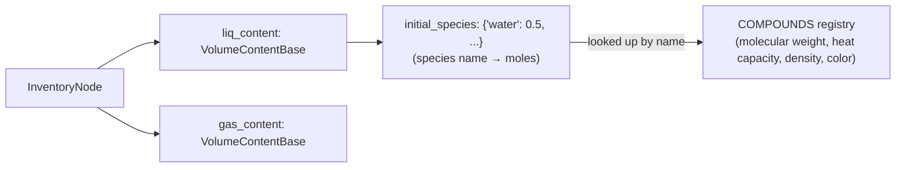
```mermaid
flowchart LR
    Inv["InventoryNode"] --> Liq["liq_content: VolumeContentBase"]
    Inv --> Gas["gas_content: VolumeContentBase"]
    Liq --> Species["initial_species: {'water': 0.5, ...}<br/>(species name → moles)"]
    Species -->|"looked up by name"| Compounds["COMPOUNDS registry<br/>(molecular weight, heat capacity, density, color)"]
```

The species *amounts* live on the component; the species' *physical properties* live once, project-wide, in the
`COMPOUNDS` registry — the same registry backing the **Compounds** page described in
[Setup Digital Twins](../simulation/digital_twins.md#compounds--initial-inventory).

### Boundary conditions — telling the solver what's fixed

A `Port.boundary` is a separate thing from `closure`: `closure` is the *physical* seal state (open vs. capped),
while `boundary` is a *hydraulic solver* constraint — what the port forces the simulated network to do.

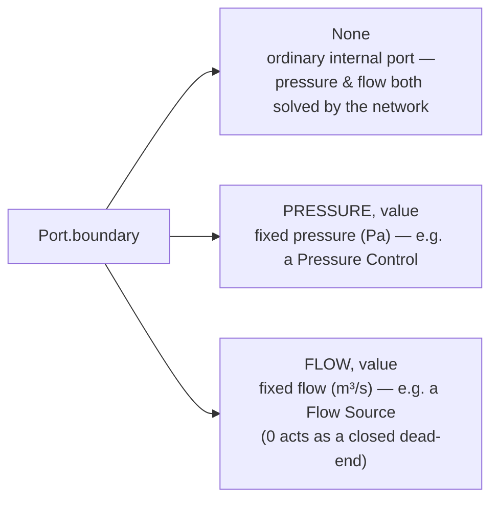
```mermaid
flowchart LR
    Port["Port.boundary"] --> None["None<br/>ordinary internal port —<br/>pressure & flow both solved by the network"]
    Port --> Pressure["PRESSURE, value<br/>fixed pressure (Pa) — e.g. a Pressure Control"]
    Port --> Flow["FLOW, value<br/>fixed flow (m³/s) — e.g. a Flow Source<br/>(0 acts as a closed dead-end)"]
```

A boundary isn't necessarily permanent — a gantry head, for example, switches its port's boundary between
atmospheric pressure (idle) and `None` (inserted into a vessel) as it moves, entirely inside
`sync_internal_state()`.

<div class="warning-block">
<strong>⚠️ Don't confuse the two</strong><br>
<code>PortClosure</code> (<code>OPEN</code>/<code>CAPPED</code>) is what the user physically did to the port.
<code>PortBoundaryCondition</code> is what the hydraulic solver assumes at that port. A capped port and a
pressure-boundary port can look identical on the canvas but mean very different things to the simulator.
</div>

## Two different things are both called "edge"

This is the single most common point of confusion, so it gets its own section: **`InternalEdge`** and
**`EdgeData`/`EdgeMode`** are not the same concept.

* `InternalEdge` lives *inside* one component's own `internal_edges` dict — private plumbing the component
  author defines (a valve's rotor channel, a reactor's coil).
* `EdgeData`/`EdgeMode` is the *process-level* connection you draw between two different components on the
  canvas — external tubing, with its own `length`, `diameter`, and `classification` (the same `HYDRAULIC` /
  `HEAT` / `ELECTRONIC` / `MOVEMENT` categories as ports).

Ports are the seam between the two graphs:

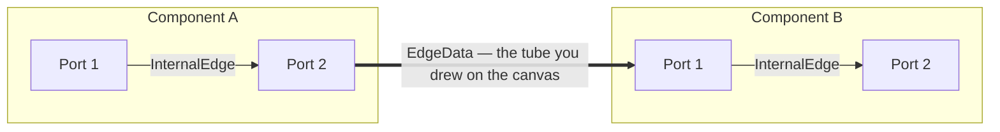
```mermaid
flowchart LR
    subgraph CompA["Component A"]
        A1["Port 1"] -->|"InternalEdge"| A2["Port 2"]
    end
    subgraph CompB["Component B"]
        B1["Port 1"] -->|"InternalEdge"| B2["Port 2"]
    end
    A2 ==>|"EdgeData — the tube you drew on the canvas"| B1
```

A component's own internal topology is invisible to its neighbors — all a neighboring component sees is the
port it's connected to.

## Common topology recipes

Most new components are one of a handful of recurring shapes. Picking the right one first makes everything else
(the `Mode` fields, the figure registry entry, the command methods) fall into place.

### Two-port inline transport

Tubing, loops, columns, flow reactors — anything where geometry alone determines resistance.

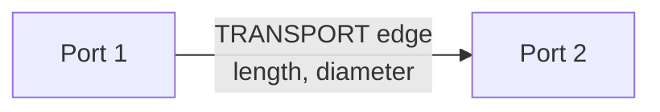
```mermaid
flowchart LR
    P1["Port 1"] -->|"TRANSPORT edge<br/>length, diameter"| P2["Port 2"]
```

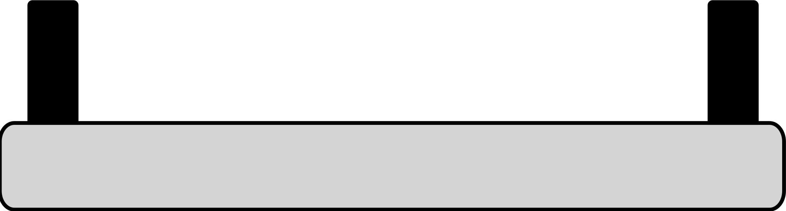 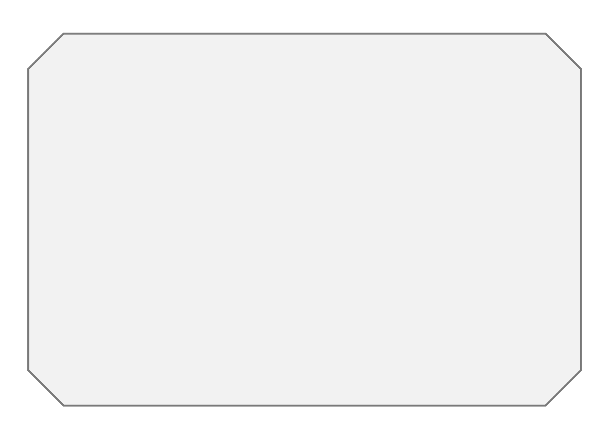

### Terminal fixed-flow

A component with one port that forces a flow rate onto the network — a flow source.

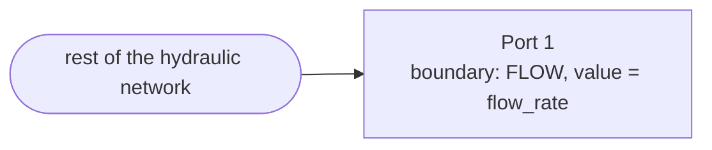
```mermaid
flowchart LR
    Net(["rest of the hydraulic network"]) --> P1["Port 1<br/>boundary: FLOW, value = flow_rate"]
```

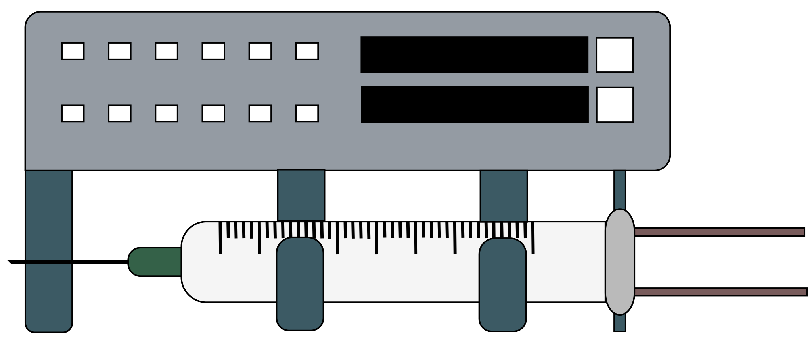

### Terminal fixed-pressure

A component with one port that forces a pressure onto the network — the strongest constraint in the system.

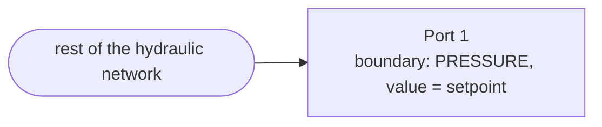
```mermaid
flowchart LR
    Net(["rest of the hydraulic network"]) --> P1["Port 1<br/>boundary: PRESSURE, value = setpoint"]
```

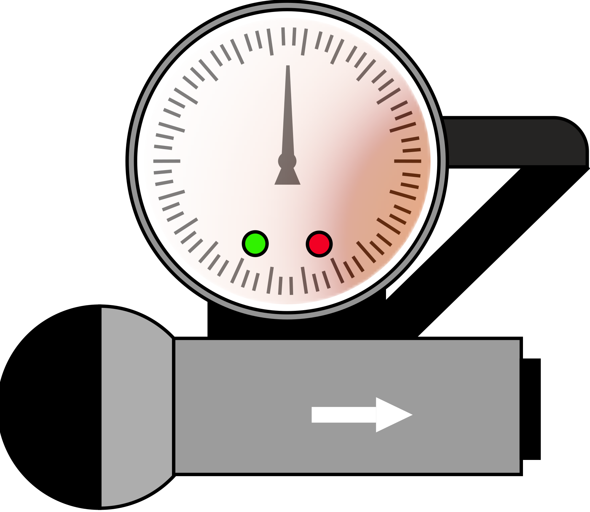

### Junction with hidden hub

A splitter or combiner: several visible ports meeting at one hidden internal hub through lossless `JUNCTION`
edges.

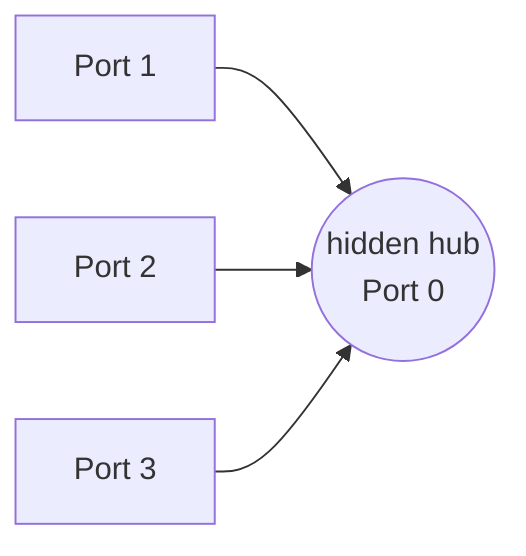
```mermaid
flowchart LR
    P1["Port 1"] --> P0(("hidden hub<br/>Port 0"))
    P2["Port 2"] --> P0
    P3["Port 3"] --> P0
```


### Vessel with inventory

Flasks, bottles, vials, wells — any storage object. Both ports connect to the same `InventoryNode` through
`JUNCTION` edges.

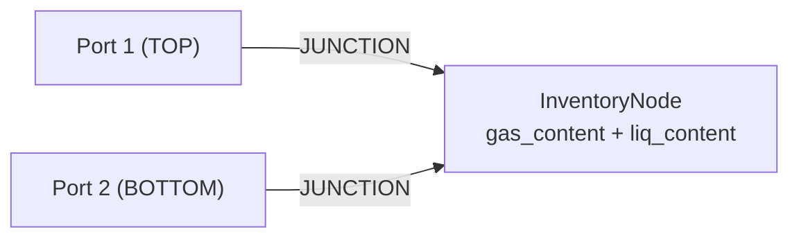
```mermaid
flowchart LR
    P1["Port 1 (TOP)"] -->|"JUNCTION"| Inv["InventoryNode<br/>gas_content + liq_content"]
    P2["Port 2 (BOTTOM)"] -->|"JUNCTION"| Inv
```

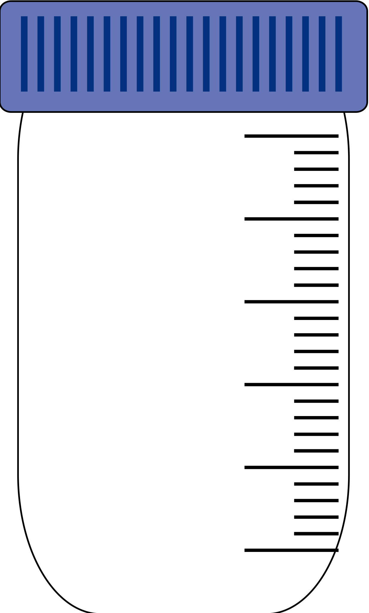 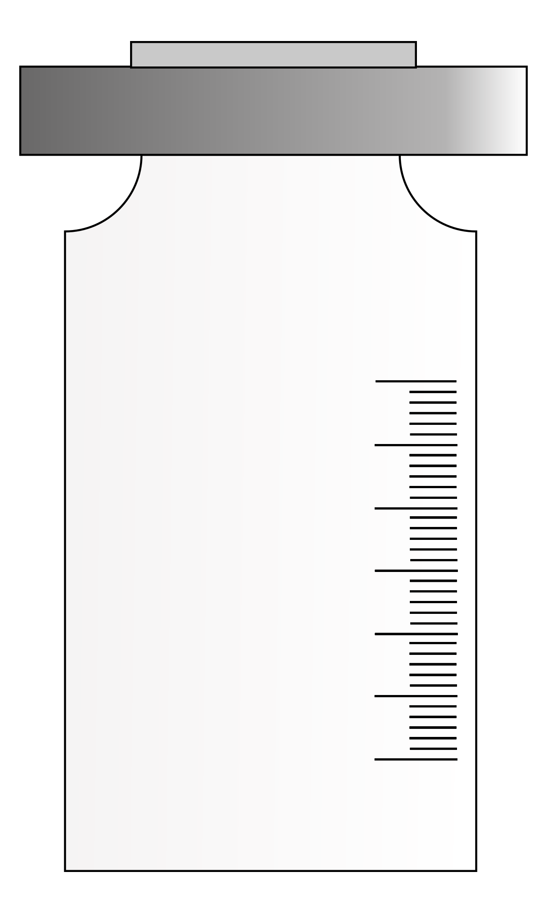

### Switchable edge

Valves, regulators, flow controllers — every possible internal edge already exists; only its open/closed state
changes.

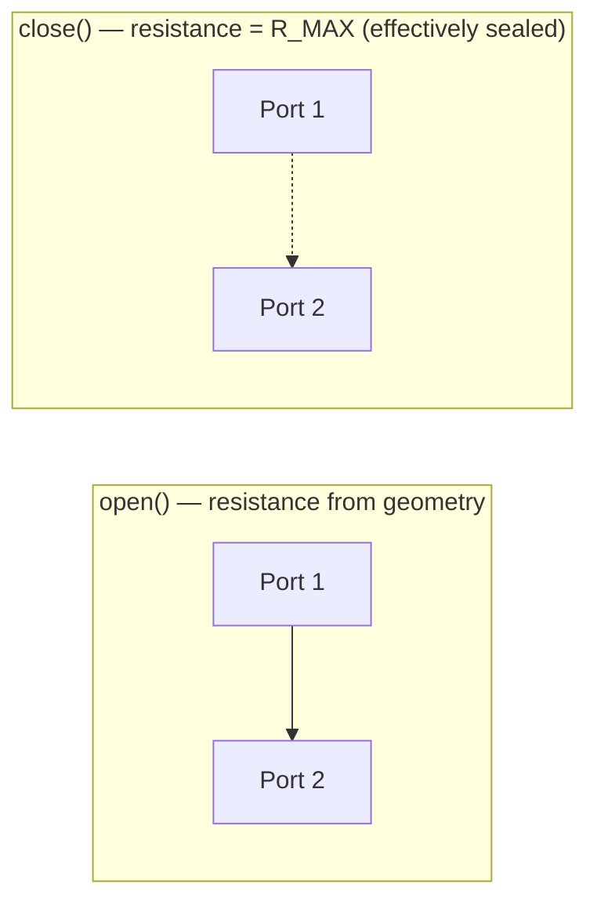
```mermaid
flowchart LR
    subgraph Open["open() — resistance from geometry"]
        O1["Port 1"] --> O2["Port 2"]
    end
    subgraph Closed["close() — resistance = R_MAX (effectively sealed)"]
        C1["Port 1"] -.-> C2["Port 2"]
    end
```

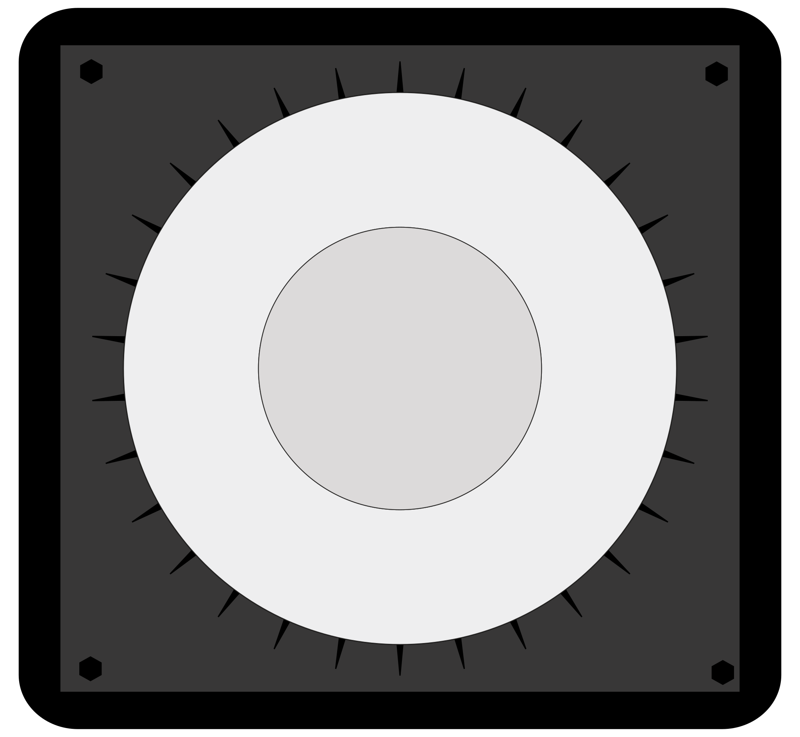 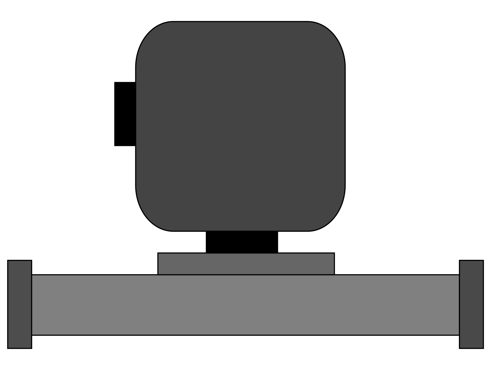

<div class="info-block">
<strong>💡 Choosing the right shape</strong><br>
Ask what graph the simulator should see: one node that fixes flow → terminal fixed-flow. One node that fixes
pressure → terminal fixed-pressure. A physical channel → two ports and a TRANSPORT edge. A splitter/combiner →
visible ports plus a hidden JUNCTION hub. A storage object → ports plus an InventoryNode. A switch → every edge
exists, inactive ones are closed.
</div>

## Classification and the command interaction model

Every `ComponentData` carries a class-level `COMPONENT_TYPE`, either:

* **`ELECTRONIC`** — controlled by protocol commands (pumps, valves, controllers, analytical instruments).
* **`UTENSIL`** — passive physical equipment with no commands of its own (tubing, junctions, plain vessels).

This determines which runtime manager assembles it, and is exposed as the `is_electronic` property.

Electronically controlled components share one interaction contract, three methods:

* **`put(command, **kwargs)`** — pure validation/planning. Must not mutate anything.
* **`apply(command, **kwargs)`** — mutates the live component, calls `sync_internal_state()` if the change
  affects topology or boundaries, and returns a `PutResult`.
* **`get(command, **kwargs)`** — a read-only query (e.g. reading back a live temperature).

A `PutResult` can also carry `scheduled: list[ScheduledCommand]` — follow-up commands to fire automatically after
a delay, without the caller having to track time itself. A syringe pump's `infuse` command uses exactly this to
schedule its own `stop`:

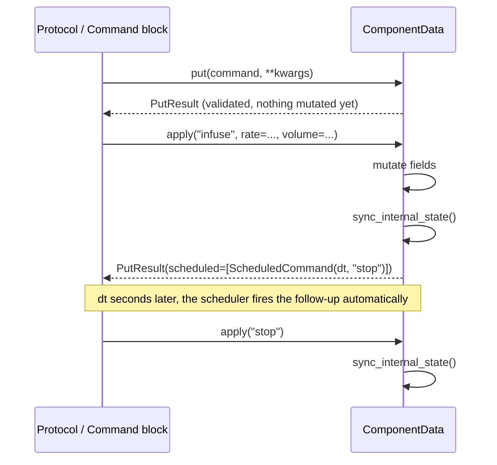
```mermaid
sequenceDiagram
    participant Caller as Protocol / Command block
    participant Data as ComponentData
    Caller->>Data: put(command, **kwargs)
    Data-->>Caller: PutResult (validated, nothing mutated yet)
    Caller->>Data: apply("infuse", rate=..., volume=...)
    Data->>Data: mutate fields
    Data->>Data: sync_internal_state()
    Data-->>Caller: PutResult(scheduled=[ScheduledCommand(dt, "stop")])
    Note over Caller,Data: dt seconds later, the scheduler fires the follow-up automatically
    Caller->>Data: apply("stop")
    Data->>Data: sync_internal_state()
```

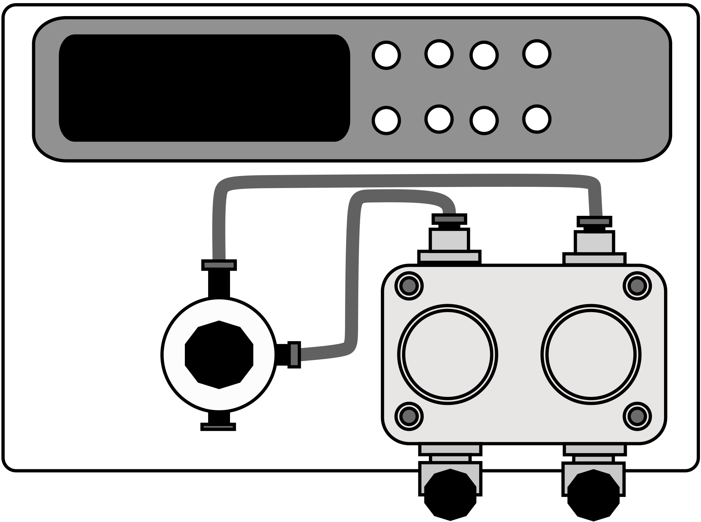 

A simpler, synchronous example: a solenoid valve's `apply("open")` just flips a boolean and calls
`sync_internal_state()`, which opens or closes its internal edges to match — no scheduling involved.

## Declaring the command vocabulary

`apply()`/`put()` is *where* a command executes. What commands exist in the first place, and their typed
parameters, is declared separately in `chemunited_core.protocols`: a `CommandSignature` per command, grouped into
a `ComponentProtocol` for the component's `figure` type. This is deliberately declarative — no networking code
belongs there, only names and parameters.

You've already seen the user-facing side of this without necessarily connecting it to the component model: the
[Command module](../protocols/command.md) you drag from the Command List onto a workflow canvas is built from
exactly this declared vocabulary, and generates code that calls straight into `put()`:

```python
def command_1(self, ctx: NodeExecutionContext) -> bool:
    self.platform["pt100"].put(
        "power-on",
        description="Turn on temperature controlling",
    )
    return True
```

## The `figure` name is the join key

A component's `figure` string (the same value set on both `ComponentMode.figure` and `ComponentData.figure`) is
what ties three otherwise-independent registries together:

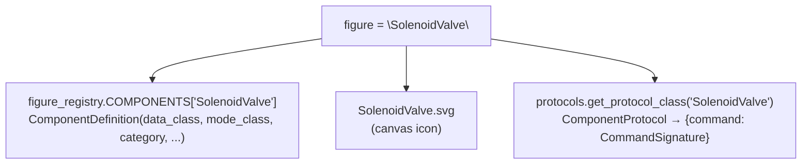
```mermaid
flowchart TB
    Figure["figure = \"SolenoidValve\""]
    Figure --> Def["figure_registry.COMPONENTS['SolenoidValve']<br/>ComponentDefinition(data_class, mode_class, category, ...)"]
    Figure --> Svg["SolenoidValve.svg<br/>(canvas icon)"]
    Figure --> Proto["protocols.get_protocol_class('SolenoidValve')<br/>ComponentProtocol → {command: CommandSignature}"]
```

This is exactly what lets a project-local `components/` folder register a fully working custom component —
`register_component()` plus `register_figure()`/an adjacent `.svg`, plus `register_protocol()` if it's
electronic — without touching `chemunited-core` at all, as shown in
[Add new components](add_components.md#from-your-own-project-no-chemunited-core-changes-needed).

## Worked example: mixing hydraulic and electronic ports

A component isn't limited to one connection type. A UV/Vis flow-cell detector, for example, is hydraulically a
plain two-port channel — but it also needs an electronic port to report its reading, and is classified
`ELECTRONIC` so it can be commanded (e.g. to change its monitored wavelength):

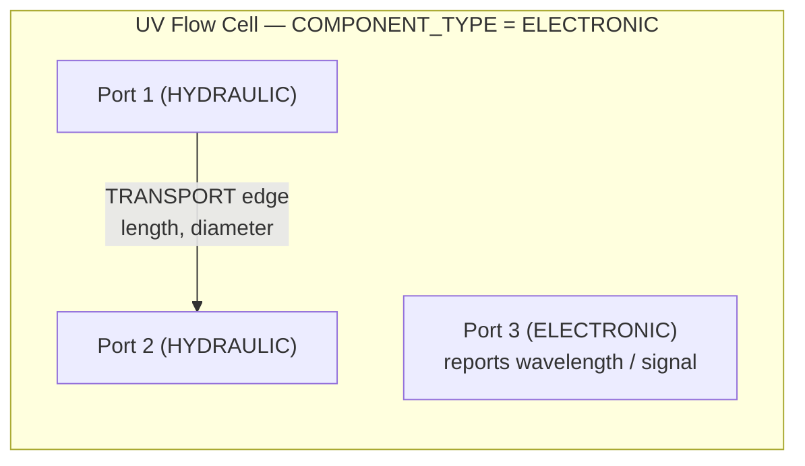
```mermaid
flowchart LR
    subgraph Cell["UV Flow Cell — COMPONENT_TYPE = ELECTRONIC"]
        P1["Port 1 (HYDRAULIC)"] -->|"TRANSPORT edge<br/>length, diameter"| P2["Port 2 (HYDRAULIC)"]
        P3["Port 3 (ELECTRONIC)<br/>reports wavelength / signal"]
    end
```

Its `port_pairs` are `[(1, 2), (3,)]` — ports 1 and 2 form the valid hydraulic pass-through pair, and port 3 is
its own standalone group with no hydraulic partner. `internal_edges` only contains the `(1, 2)` transport edge;
port 3 needs none, since nothing flows through it. This is the general pattern for any electronically-controlled
component that also sits inline in the fluid path — the two concerns (hydraulics and commands) are declared
independently and simply coexist on the same component.

## Where to go next

* Ready to write one? → [Add new components](add_components.md) walks through the practical steps and file
  layout.
* Want to see the whole catalog these shapes produce? → [Components available](../reference/components.md).
* Want to change what happens to a vessel's *chemical contents* over time, rather than its structure? →
  [Customize protocols](add_features.md) covers reaction models, the layer above everything on this page.
