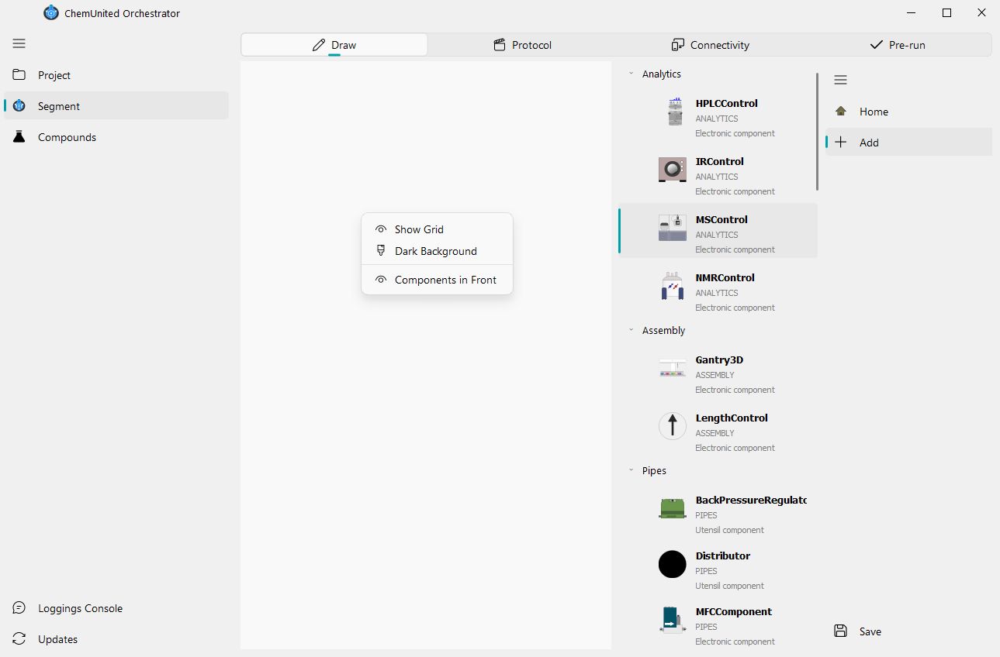
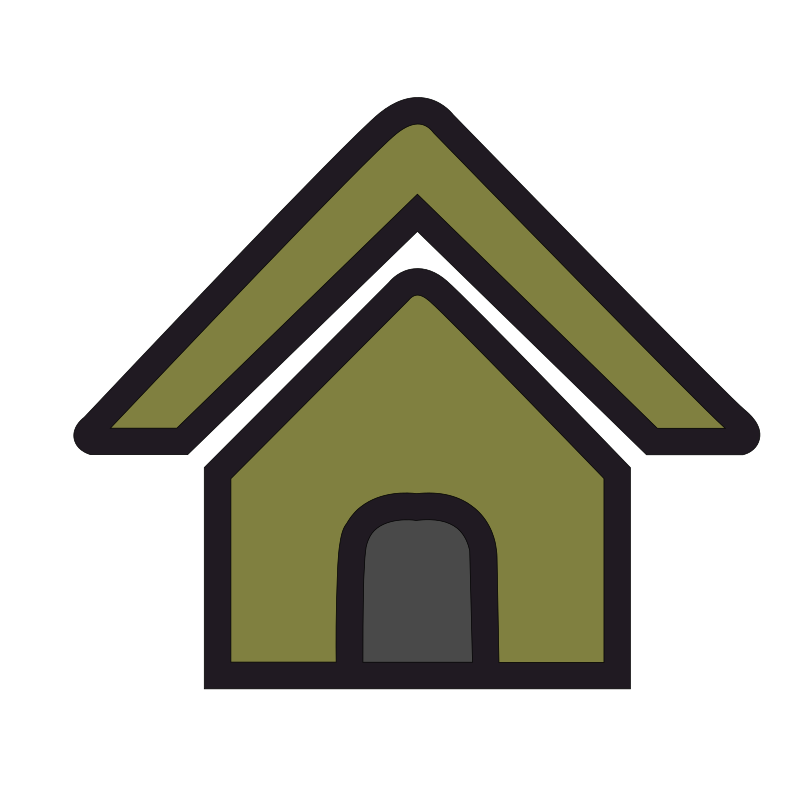
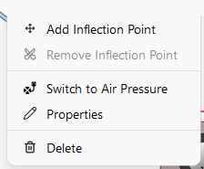
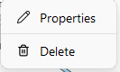

# 🎨 Drawing

The objective of this frame is to allow the user to design their own platform by dragging and dropping components onto the canvas.

Below is a description of the main tools available in this window:

*  **Home**

Centers the drawing on the canvas. This is useful for reorienting the view and exploring your setup more easily.

*  **Save**

Saves all modifications made to the current project file.

*  **Add**

Opens the component library, from which you can add new electronic elements or utensils to the setup.

## 🖱️ Right-Click Menu

Right-clicking gives you quick access to context-specific actions, depending on what you click on.

  
  
  

<em>Right-click menu on a connection, a component, and the empty canvas.</em>

### On a connection

* **Switch to Curved** — toggles the connection's routing between straight segments and a curved line.
* **Add Inflection Point** — inserts a new draggable waypoint, useful for routing the connection around other
  components.
* **Remove Inflection Point** — removes the closest inflection point; disabled when the connection has none.
* **Switch to Air Pressure** — changes the connection's role to represent a pneumatic/air-pressure line instead of
  a standard fluid line.
* **Properties** — opens the connection's property editor.
* **Delete** — removes the connection.

### On a component

* **Properties** — opens the component's property editor.
* **Delete** — removes the component from the platform.

### On the empty canvas

* **Show Grid** — toggles a background grid on the canvas, useful for aligning components.
* **Dark Background** — toggles the canvas background between light and dark.
* **Components in Front** — brings every component to the front of the drawing.

## Component available

This panel lists all components available for building your setup, organized into categories.

## Connections

Connections define how components interact within the setup. Each connection begins and ends at a connection point, 
and each point belongs to a specific category. Only connection points of the same category can be linked.

### Types of Connection Points

There are four standardized connection point types:

*  **Flow Connection Point**

Represents standard connections used for tubing that transports fluids through the system.

*  **Heat Connection Point**

Used for defining heat-transfer relationships between components during simulation.
These connections affect simulated thermal behavior, but they do not influence the execution of the real protocol.

*  **Electronic Connection Point**

Used for connections that transmit electronic control signals.
While devices in ChemUnited can be accessed directly, in certain cases, it is more 
efficient to trigger device actions through the microcontroller connected to it. This is especially useful when 
several devices must be activated simultaneously.
For more details on the microcontroller implementation, see the referenced documentation.

*  **Movement Connection Point**

An extension of the flow connection, used to represent the movement of samples—typically handled by mechanical 
arms, gantries, or other robotic modules.

<strong>⚠️ Warning</strong> 
A connection can only be established between points of the same type (Flow–Flow, Heat–Heat, Electronic–Electronic, or Movement–Movement).

## Components & connections properties

After adding a component, a window will appear where the user can provide the component’s details.
The most important field is the name, which serves as the unique identifier for accessing the component throughout the entire project.

<strong>⚠️ Warning</strong> 
Choose the component name carefully. All properties, protocols, and orchestration features are linked to this name. 
If you need to rename a component later, the recommended approach is to <b>remove and recreate it again</b> 
using the new name. 

Unlike components, connection properties do not open automatically.

 
<strong>💡 Information</strong>  
While all components share some common parameters, each one also includes
<b>specific adjustable settings</b> depending on its type.

More details about each component can be found in the reference section: [Components Available](../reference/components.md).
