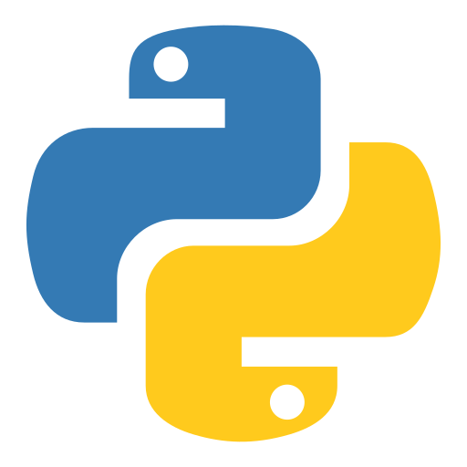
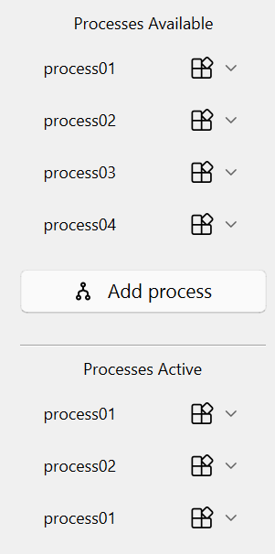
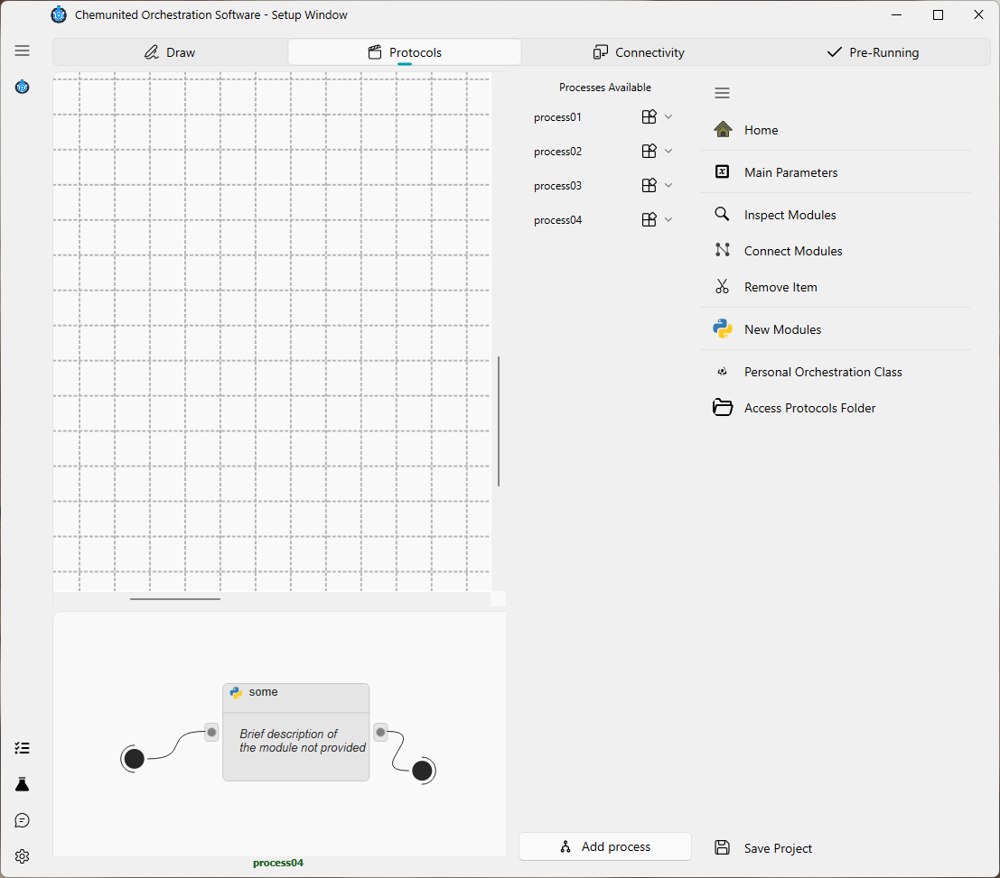
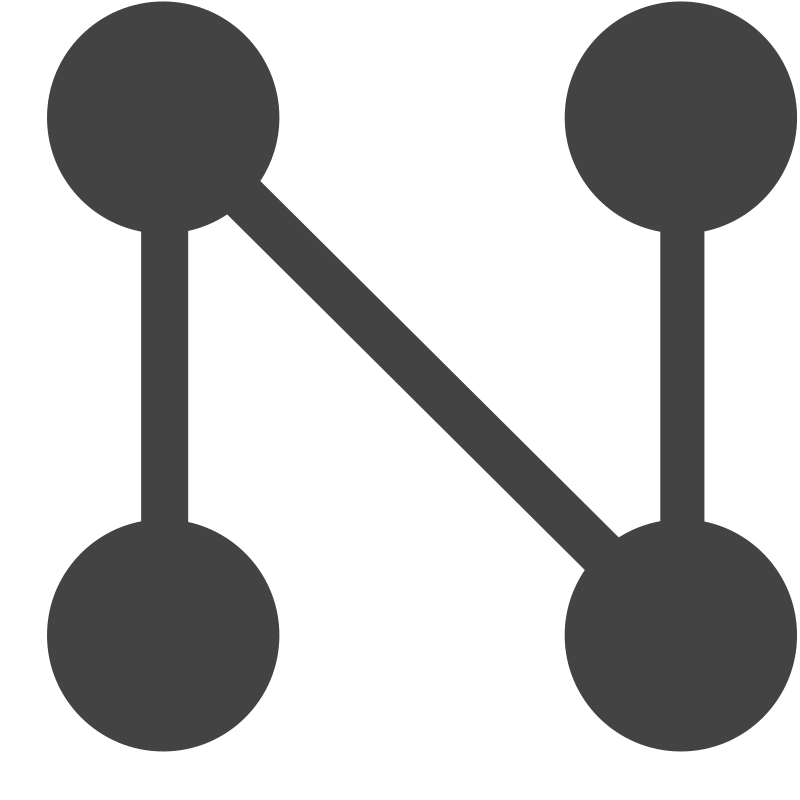

# ✅ Build Protocols

The objective of this frame is to create and organize the protocols that define how the platform operates.

Before explaining how the orchestration system is designed to build these protocols, it is important to understand 
how the protocol structure is organized within the package.

## 🧩 Protocol Hierarchy

The following diagram illustrates the hierarchical relationship between the different elements that make up a protocol:

<strong>💡 Information</strong>  
This hierarchical organization allows the orchestration to combine automation logic with flexible scripting. 
Complex experimental protocols can therefore be built by combining processes, modules, and component-level commands. 

## Explanation of Each Level

### 💻 Protocol

A protocol is the highest level in the orchestration hierarchy.
It is composed of a series of processes, which are executed sequentially, one after another.

###  Process

Each process contains one or more workflows composed of modules.
Processes are executed in sequence, but within a process, the modules can run simultaneously through a multithreading workflow.

###  Module

A module represents a Python script containing a sequence of commands.
This design gives the user complete flexibility — any Python libraries can be used to support the protocol development.

###  Command

A command is the lowest-level instruction in the hierarchy.
It represents a specific request or actuation sent to an electronic component in the system (e.g., start a pump, read a sensor, open a valve).

###  Parameters

The Parameters script defines a set of variables that the user can create and reuse across the entire platform.
This feature is optional, but extremely helpful for complex setups where protocols depend on shared values, user-defined constants, or validation logic.

There are two types of parameters:

* Main Parameters – global variables available to all protocols in the project.
These typically define general configuration values that remain consistent throughout the orchestration.

* Process Parameters – local variables defined within a specific process.
They apply only to that process and allow fine-tuning of parameters without affecting other parts of the platform.

Using parameters promotes modularity and flexibility: the same protocol can be reused with different parameter sets, and complex workflows can automatically validate or adjust values before execution.

## 🧩 Process Availability

When building protocols, each process can have one of two statuses:

1. **Available**

The process is defined and stored in the protocol, but **not** currently scheduled for execution.

2. **Active**

The process is enabled and will be executed in simulation/monitoring mode.

These statuses allow the user to define multiple processes and then decide **which ones** will run and **in which order**.  
The user can also repeat the same process multiple times by adding it more than once to the *Active* list.

  

In the example, we have four independent processes in the **Available** list, while the **Active** list contains 
three entries, where `process01` appears twice. 
In this case, the execution sequence will be:
    
`process01` → `process02` → `process01`
    
This flexibility in arranging the Active list (and repeating individual processes) allows the user to customize
different execution scenarios according to their needs.

.

## ChemUnited Protocols Panel

The main protocols panel is shown below.

This frame is divided into three areas:

1. **Platform layout**

The platform drawing is displayed here. Although it does not have any direct functionality for protocol building, it is very useful for 
inspecting the physical setup so the user can write commands correctly.

2. **Process workflow canvas**

In this area the process workflow is built by adding new modules/blocks and connecting them. 
The details of how to build and edit workflows are explained in the [next section](module_workflows.md).

3. **Available and Active process lists**

On the right side you will find two lists: **Available** and **Active** processes.
Each item in the list has a context menu 
(accessed via ) with the following options.

**For items in the Available list:**

   - ➡️ **send**: Move the item to the Active list.  
   - ✏️ **edit**: Rename the item.  
   -  **parameter**: Open the process parameter settings.  
   - 📚 **duplicate**: Create a copy of the item.  
   -  **remove**: Delete the item.

   **For items in the Active list:**

   - 📚 **duplicate**: Create a copy of the item.  
   -  **remove**: Remove the item from the Active list.

---

### Navigation options

On the right side of the frame there is a set of navigation buttons:

*  **Add process**

Create a new process and add it to the Available list.

*  **Experiment Parameters**  

Open the main experiment parameter script of the project. 
This button launches the script editor, which is described in the [next section](script_editor.md).

*  **Inspect Modules**  

Inspect modules in the process workflow. After clicking this option, click on the module you want to inspect at the 
 icon position.

*  **Create Connection**

Enable connection mode to build links between modules/blocks.
Click the icon of the first block, then the icon of the second block to create the connection.

*  **Remove Item**

Enable removal mode to delete blocks/modules or the connections between them.

*  **New Module**  

Create a new module/block.

*  **Personal Orchestrator Class**  

Advanced option to open the orchestrator class script in the script editor and customize it. 
This feature is recommended for advanced users who need to build custom classes and objects.

*  **Access Protocols Folder**  

Open the directory where the protocol scripts are stored on the computer.

*  **Save Project**  

Save the current project protocols.