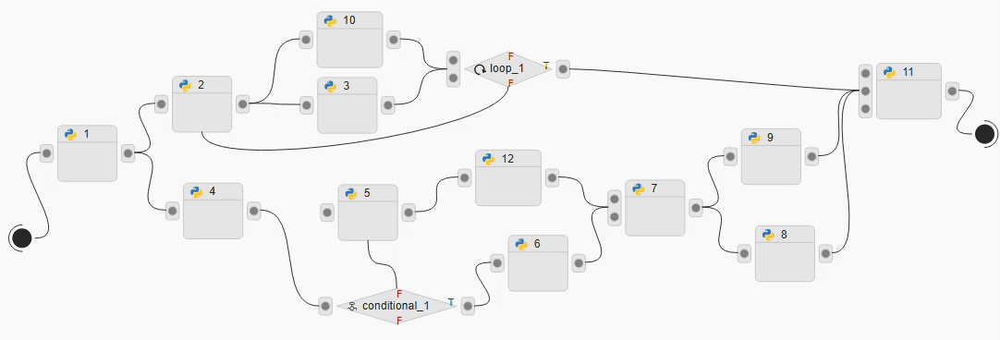
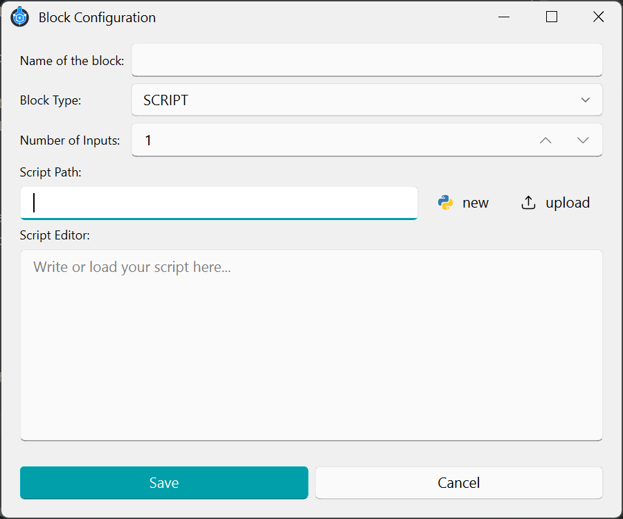

#  Process workflow

A process is built as a workflow made of multiple modules.
The workflow controls how modules are executed, handling:

* parallel execution

* conditions (branching)

* loops (repetition)

This keeps control logic outside individual modules (sometimes called blocks), so each module stays focused on a single task.

## Module Types

There are three kinds of modules.

*  Script

A Script module contains the actual commands to run.
Use it to define the step-by-step actions of your protocol.

*  Loop

A Loop module repeats one or more modules.
Use it when a part of the protocol must run multiple times (for example: iterating over modules or repeating a some step).

*  Conditional

A Conditional module creates a branching point in the workflow.
Depending on the defined criteria, the process follows one branch or another.

## Why use workflows?

Technically, you can implement loops and conditionals inside a single Script module using Python packages and native functions.
However, we recommend using the workflow approach because it makes protocols:

* easier to read and maintain

* more modular and reusable

* better structured (logic is explicit in the workflow)

## Example



In the example above, you can follow how the workflow is executed:

**1) Parallel execution (fan-out)**

After *modules 1, 2*, and *7*, the workflow splits into multiple branches.
This means the next connected modules can run in parallel (when they are independent).

**2) Loop execution**

The module *loop_1* repeats a part of the workflow.
In this example, it triggers the repeated execution of the branch that starts at *module 2*.

**3) Conditional execution (branching)**

The module *conditional_1* chooses one branch based on the condition criteria.
Here, it selects between the branch starting at *module 5* or *module 6*.

**4) Synchronization (wait / join)**

Some modules only start when all required input branches have finished.
For example, *module 11* waits until every incoming branch completes before it begins execution.

## Building a module

To create a new module, click  New Module.
A window like the one below will open:



### Required information

Fill in the following fields:

* **Module name**

A unique name that identifies the module in the workflow.

* **Block type** (Choose the module type): 
  * Script

  * Loop

  * Conditional

* **Number of inputs**

How many modules will connect into this module.
This is used only for layout/design in the workflow editor (it does not change the execution logic).

* **Script path**

The location of the script file associated with this module.

#### Script options

You can either:

* create a new script for this module, or

* upload an existing script.

#### Saving

When you click Save, the script is stored automatically in the project directory using this structure:

```
...\ <project_folder> \ <current_process> \ module_name.py
```

Note: The saved filename is based on the module name.