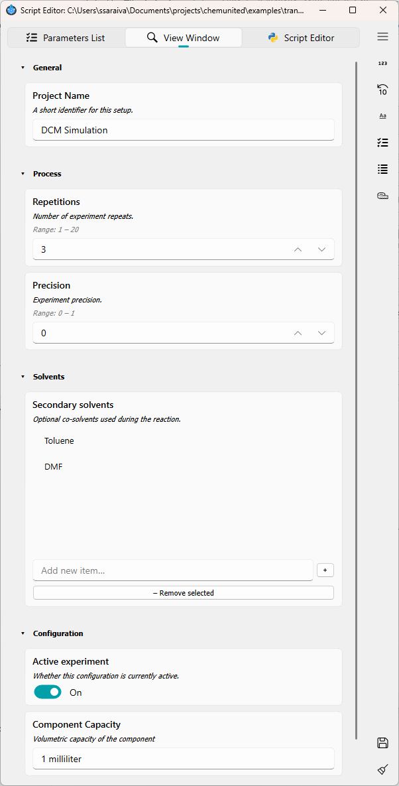

# Parameters

The Parameters window is a helper tool for creating variables (parameters) and making them available inside your scripts.


On the right side, you will find a list of parameters type that can be inserted into the script.

## Creating a new parameter

When you add a new variable, a configuration window opens. In this window you can define the main characteristics of the parameter:

* General

    *Defines what the variable is and how it should be presented to the user.*

* Organization

    *Controls where the variable appears in the GUI (for easier navigation).*

* Behavior

    *Controls whether the user can see and edit the variable in the GUI.*

* Validation

    *Adds value constraints to prevent invalid inputs.*

## Supported parameter types

The following parameter types are supported. 
When a parameter is created, a corresponding Field(...) definition is generated automatically.

1. Integer

```python
repetitions: int = Field(
        default=3,
        title="Repetitions",
        description="Number of experiment repeats.",
        ge=1,
        le=20,
        json_schema_extra={"group": "Process"},
    )
```

2. Float 

```python
precision: int = Field(
        default=0.8,
        title="Precision",
        description="Experiment precision.",
        ge=0,
        le=1,
        json_schema_extra={"group": "Process"},
    )
```

3. String

```python
project_name: str = Field(
        default="Simulation",
        title="Project Name",
        description="A short identifier for this setup.",
        json_schema_extra={"group": "General"},
    )
```

4. Array

```python
secondary_solvents: list[str] = Field(
        default=["Toluene", "DMF"],
        title="Secondary solvents",
        description="Optional co-solvents used during the reaction.",
        json_schema_extra={"group": "Solvents"},
    )
```

5. Choice

```python
solvent: str = Field(
        default="DCM",
        title="Main solvent",
        description="Select the solvent used in the process.",
        json_schema_extra={
            "group": "Solvents",
            "Options": ["DCM", "Toluene", "Acetone", "DMF"],
        },
    )
```

6. Physical

```python
capacity: Annotated[
        ChemUnitQuantity,
        ChemQuantityValidator("ml"),
    ] = Field(
        default=ChemUnitQuantity("1 ml"),
        title="Component Capacity",
        description="Volumetric capacity of the component",
        json_schema_extra={
            "group": "Configuration",
        },
    )
```

7. Boolean

```python
active: bool = Field(
        default=True,
        title="Active experiment",
        description="Whether this configuration is currently active.",
        json_schema_extra={"group": "Configuration"},
    )
```

## How parameters appear to the user

After defining these parameters, the platform automatically generates the configuration window where the user can view and edit them (depending on the Behavior settings):




