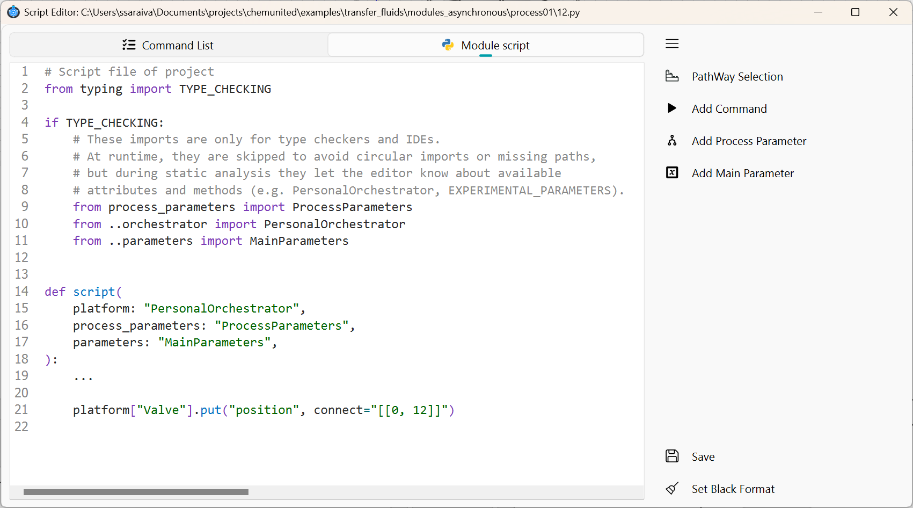
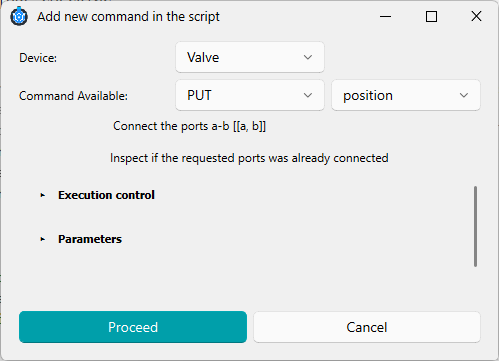

# Script Editor

After creating a module, you can open and edit its script from the workflow editor.

## Opening the script

1. Enable **Inspection Mode** (module inspection).

2. Click the **module icon** (the block) you want to inspect.

The Script Editor window will appear:



*  **PathWay Selection**

Helper tool to insert special commands for moving fluid between points on the platform.

*  **Add Command**

Helper tool to insert a new command into the script.

*  **Add Process Parameter**

Inserts parameters defined for the current process.

*  **Add Main Parameter**

Inserts global protocol parameters (shared across processes, if applicable).

*  **Save**

Save the script.

*  **Set Black Format**

Formats the script using the [black style format](https://black.readthedocs.io/en/stable/index.html).

## Building a command

The command builder window (helper tool) is shown below:



In this window, you can configure:

* Device

Lists all available electronic components in the platform.

* Command Available

Shows the commands supported by the selected device, including a short description of what each command does.

<div class="info-block"> <strong>
💡 Information</strong><br> Commands are organized by HTTP method: <strong>GET</strong>, <strong>PUT</strong>, and <strong>POST</strong>.
<br><br> <strong>GET</strong> is typically used to read status or measurements (e.g., sensors).
<br> <strong>PUT</strong> is typically used to change the device state or behavior (e.g., actuators).
<br> <strong>POST</strong> is less common and is usually used to send larger or more complex data payloads.
</div>

### Command options

In the options of the commands we also have.

#### Execution control

Execution control defines how the workflow should wait before continuing to the next command. 
It includes three configurable options and one informational field, as illustrated below:
    


* **Customize Wait Time After Execution**
        
    If enabled, the script waits for a custom duration after running the command.
    The default delay is 1 second, but in some cases the software may compute an internal delay automatically based on the command.
       
* **Wait Time (s)**
  
   A fixed delay (in seconds) applied before the next command runs.
   Useful to avoid timing conflicts, device overload, or overlapping actions in the physical setup.

* **Wait for Feedback Status Change**
                            
    If enabled, the script pauses until a status change is detected from the device.
    This ensures the workflow continues only when the system is ready.
                       
* **Feedback Trigger Command (Informative)**
      
    Internal command used by the system to block execution until a hardware or process condition is met.
    It is issued after the main command and after the configured wait time.

#### Parameters

Defines the input parameters required by the selected command (if any).
The available fields depend on the chosen device and command.

## Accessing Parameters

When you click `Add Process Parameter` or `Add Main Parameter`, a list of available parameters is displayed.
Select the parameter you want to insert and click `Proceed`.

## Command Line

After you build a command, the editor automatically generates a block of Python code.

In the example below, the script sends a command to pump `"pump A"` to infuse 5 mL at 20 mL/min.
After sending the command, the script waits 1 second and then continues to the next line.
Note that the command does not wait for pump feedback because `wait_feedback_status=False`.

```python
...
def script(
    platform: "PersonalOrchestrator",
    process_parameters: "ProcessParameters",
    parameters: "MainParameters",
):
    platform["pump A"].put(  # Component name: pump A
        "infuse",       # Command name
        rate="20.0 milliliter / minute",  # Command parameter
        volume="5 milliliter",            # Command parameter
        wait=1.0,                         # Custom wait time (seconds)
        # If True, waits for device feedback (e.g., pump finishes infusing)
        wait_feedback_status=False,
    )
    ...
```

If you want to use a predefined parameter from the process or main parameters, insert it in the desired field (or copy and paste it into the generated code).

In the example below, the predefined `pump_vol` from `process_parameters` is used as the infusion volume:

```python
...
def script(
    platform: "PersonalOrchestrator",
    process_parameters: "ProcessParameters",
    parameters: "MainParameters",
):
    platform["pump A"].put(  # Component name: pump A
        "infuse",       # Command name
        rate="20.0 milliliter / minute",   # Command parameter
        volume=process_parameters.pump_vol, # Use predefined value
        wait=1.0,                           # Custom wait time (seconds)
        # If True, waits for device feedback (e.g., pump finishes infusing)
        wait_feedback_status=False,
    )
    ...
```


