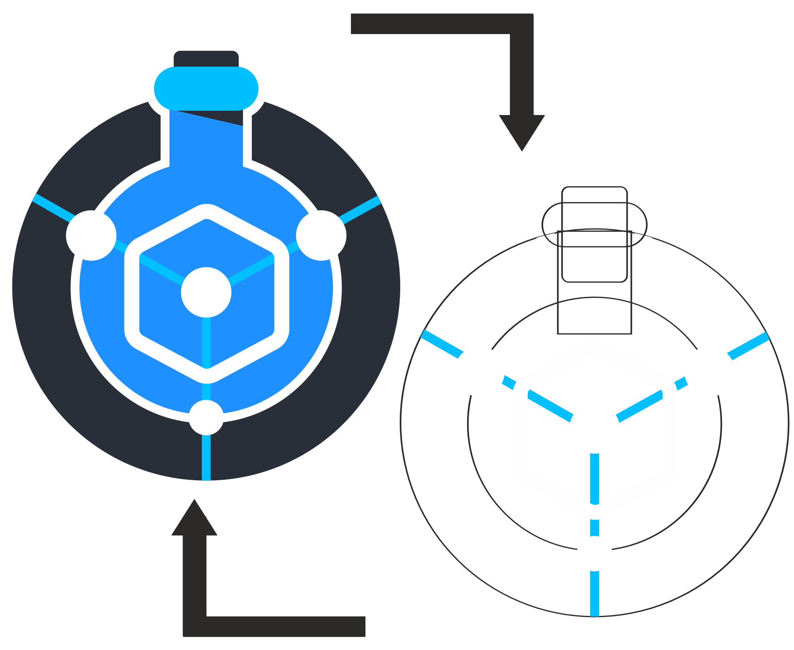

#  Setup Digital Twins

A **digital twin** is a physics-based virtual copy of your platform. A protocol can run against it instead of
real hardware — useful for dry-testing logic, timing, and expected inventory changes before touching real
reagents.

## 🚀 Launching a Simulation

From [Pre-Running](../protocols/pre_running.md), click

**Run Simulation** — either from the main action bar, or from a saved Protocol Files card. This starts a local
simulation engine in the background automatically; you do not need to install or run anything separately.

## 📊 The Simulation Report Window

Running a simulation opens a live report window: a graphical view of the platform alongside tabs that update in
near real time as the run progresses (the same tabs the recorded HTML dashboard produces afterward — see
"Recorded Visualizations" further down this page).

<strong>📸 Screenshot needed</strong> 
Capture: the Simulation Report window mid-run, with the platform view and tabs visible. 
Save as: <code>docs/_static/simulation01.png</code>, then replace this block with: 
<code></code>

## 🧫 Compounds & Initial Inventory

Before simulating, define what's actually inside each vessel using the **Compounds** tab in the Setup window.
This is where you set the initial chemical content (species, concentration, volume) of flasks, bottles, and
reactors on your platform — the simulation reads this as the starting state for every run.

<strong>📸 Screenshot needed</strong> 
Capture: the Compounds tab, including the "Edit inventories" dialog for a vessel. 
Save as: <code>docs/_static/compounds01.png</code>, then replace this block with: 
<code></code>

Optionally, physical properties (density, viscosity, etc.) can be looked up automatically for known compounds
rather than entered by hand.

## 🧠 What Happens Under the Hood

The same `Process`/`Platform` code that runs against real hardware runs **unmodified** against the simulator — the
simulation engine swaps in a stand-in client in place of each real HTTP device client, so no protocol code needs
to know whether it's talking to a pump or a physics model.

<strong>💡 Terms at a glance</strong> 
<strong>HydraulicGraph</strong> — the compiled network of nodes and edges built from your platform drawing, used to
solve pressures and flows. 
<strong>Pocket</strong> — a discrete slug of fluid (a phase, volume, species, temperature) moving through the
tubing. 
<strong>Resistance override</strong> — how active components like pumps, valves, and back-pressure regulators
actively drive the hydraulics, instead of passively obeying tubing geometry alone.

## 🔀 Mode 1 vs Mode 2

<strong>📸 Diagram needed</strong> 
A Mode 1 vs Mode 2 data-flow diagram was generated as an interactive draw.io diagram during this session. Export
it as SVG and save as: <code>docs/_static/simulation_modes.svg</code>, then replace this block with: 
<code></code>

| | Mode 1 — Workflow Simulation | Mode 2 — Real-Time Shadow |
|---|---|---|
| What it does | Dry-tests a protocol against physics, no hardware involved | Mirrors a live hardware run happening in the [work-server](../dashboard/overview.md), as a "ghost" alongside the real experiment |
| Speed | Runs as fast as the computer can solve it | Runs at wall-clock pace, matched to the real run |
| How to launch | The **Run Simulation** button described above | Reached through the work-server/simulation API rather than a dedicated orchestrator button today — see [API & MCP Tools](../dashboard/api_and_mcp.md) |

## 📈 Recorded Visualizations

Every simulation run is recorded and can be explored afterward as two standalone HTML files (openable in any
browser, independent of the orchestrator):

* **Dashboard** — tabs for Components, Edges, Overview, Signals, and Pipe Cells, with pressure/temperature/species
  charts per component and edge.
* **Network graph** — an interactive node/edge diagram of the platform, where node shape indicates hub/inventory/
  boundary type, node color encodes pressure and temperature, and edge width/style encodes flow.

<strong>📸 Screenshot needed</strong> 
Capture: the recorded Plotly HTML dashboard (Components/Edges/Overview/Signals/Pipe Cells tabs). 
Save as: <code>docs/_static/sim_dashboard01.png</code>, then replace this block with: 
<code></code>

<strong>📸 Screenshot needed</strong> 
Capture: the recorded network graph visualization. 
Save as: <code>docs/_static/sim_network01.png</code>, then replace this block with: 
<code></code>

## Next steps

Once your protocol behaves as expected in simulation, connect real devices in
[Connect Devices](../connectivity/connectivity.md), or see [The Dashboard](../dashboard/overview.md) to
shadow a live run with Mode 2.
