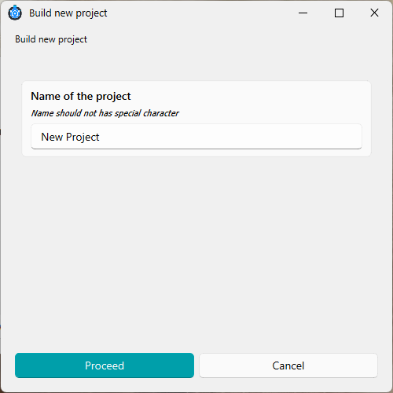
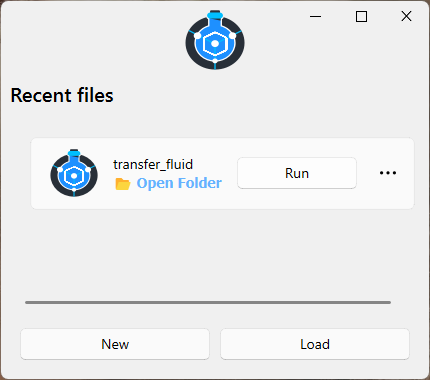

# 🧩 Build a new project

This section walks you through the steps to create a new project in ChemUnited.
By the end, you’ll know how to start the Designer, create a project folder, and understand how
ChemUnited keeps track of your recent work.

## Launch the Designer

After installing ChemUnited, open the Designer by running:

```bash
chemunited
```

This opens the **Recent Projects** window:

<p align="center">

</p>

## Create a new project

Click **New**. ChemUnited will ask you to:

1. enter a **project name**, and

2. select a **directory** where the project files will be stored.

<p align="center">


</p>

## Recent projects list

Whenever you create or open a project, ChemUnited stores its directory in a small reference file 
(used by the application internally through [appdirs](https://pypi.org/project/appdirs/)).
This is why your previously opened projects appear automatically in the Recent Projects list when you start
ChemUnited—so you can quickly resume your work.

<div class="info-block">
  <strong>💡 Tip</strong><br>
  ChemUnited projects are lightweight: they are mainly composed of Python scripts and JSON files.
For better traceability and reproducibility, we strongly recommend using version control (for example, Git) to track changes over time.

This is especially useful when you:

* update workflows and scripts frequently,

* collaborate with others,

* want to roll back to a previous working version,

* need a clear history for experiments and protocol development.
</div>

## 📘 Learning Tutorial

To dive deeper into the package, a tutorial is available that guides you through building a very simple setup.
For each step of the tutorial, the user will learn how chemunited works in practice.

The goal is to build the simple setup shown below:

<p align="center">

</p>

This setup is responsible for transferring a defined volume of fluid from one vessel to another.